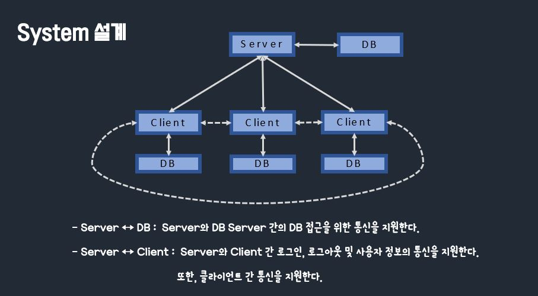
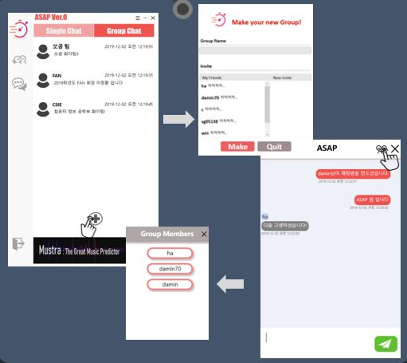
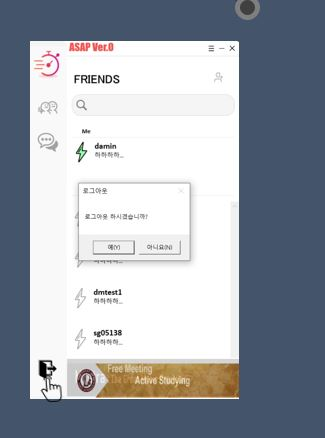

ASAP 
===

🌕 Members in this Project 
---

- 🎓 이정환
>이정환의 [README](./winterlood/README.md) 
>이정환의 [Git](https://github.com/winterlood)

- 🎓 하정구
>하정구의 [README](./hjg0629/README.md) 
>하정구의 [Git](https://github.com/hjg0629)

- 🎓 신다민
>신다민의 [README](./favian/README.md) 
>신다민의 [Git](https://github.com/damin8)

- 🎓 서정희
>서정희의 [README](./abcdefgfg1/README.md) 
>서정희의 [Git](https://github.com/abcdefgfg1)

- 🎓 김효빈
>김효빈의 [README](./sg05138/README.md) 
>김효빈의 [Git](https://github.com/sg05138)

