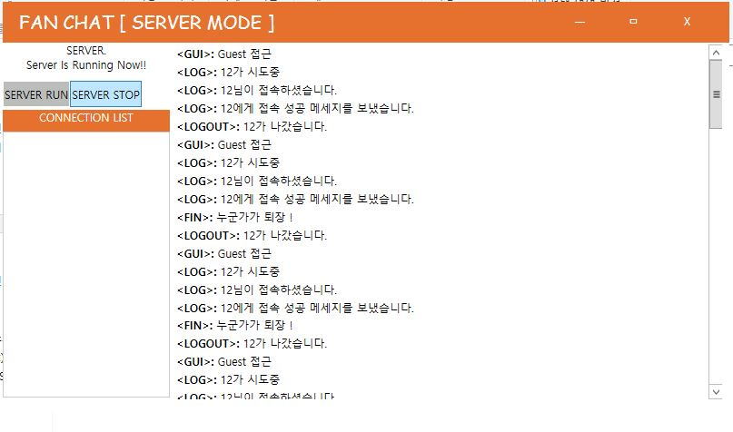
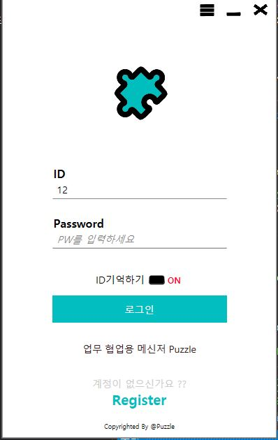
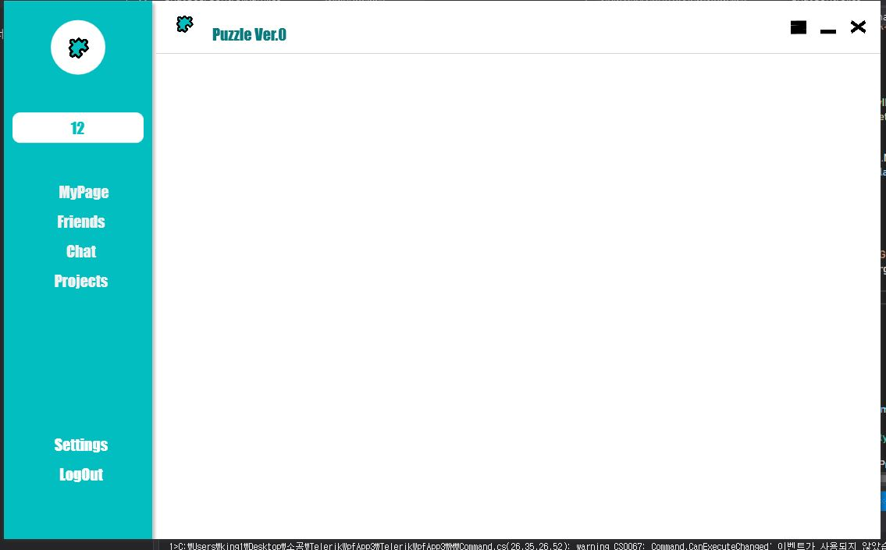
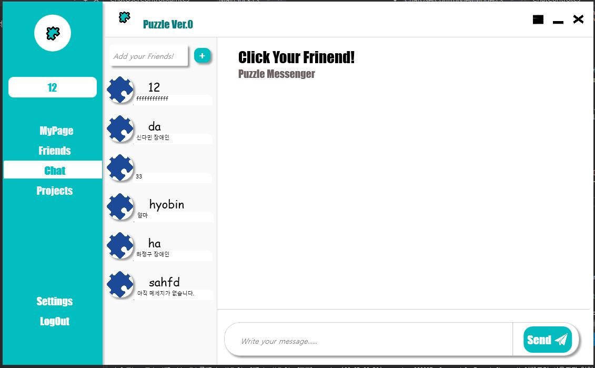
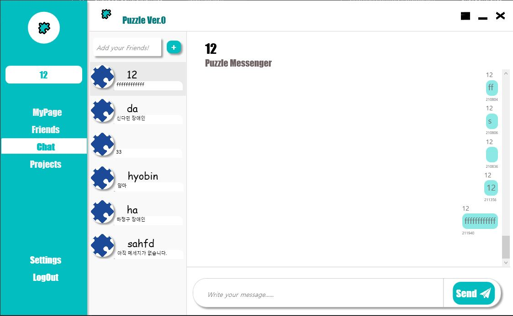

Puzzle :  업무 협업용 메신저
===
> 제1 목표 : 시장 출시! 
> 제2 목표 : 교내 출시! 
> 제3 목표 : 학회 내 출시! 

2019-09-28
===

Server : Main View
---

> 서버 안정화  
> 중복 로그인 방지  
> 예외 시 서버다운 방지  
> 커넥션 풀 도입 예정

Client : Login View
----

> id 기억하기 기능 
> 로그인 버튼 클릭시 소켓 연결

Client : Main View
---

> 좌측 UserControl들을 연결하는 Hamburger menu 구현  
1
Client : Chat Room
---

> 마지막 대화 표시 
> 친구 표시

Client : Chat Room 2
---

> 친구와의 대화기능 제공  
> 친구 추가 기능 제공 

🌕 Members in this Project 
---

- 🎓 이정환
>이정환의 [README](./winterlood/README.md) 
>이정환의 [Git](https://github.com/winterlood)

- 🎓 하정구
>하정구의 [README](./hjg0629/README.md) 
>하정구의 [Git](https://github.com/hjg0629)

- 🎓 신다민
>신다민의 [README](./favian/README.md) 
>신다민의 [Git](https://github.com/damin8)

- 🎓 서정희
>서정희의 [README](./abcdefgfg1/README.md) 
>서정희의 [Git](https://github.com/abcdefgfg1)

- 🎓 김효빈
>김효빈의 [README](./sg05138/README.md) 
>김효빈의 [Git](https://github.com/sg05138)

