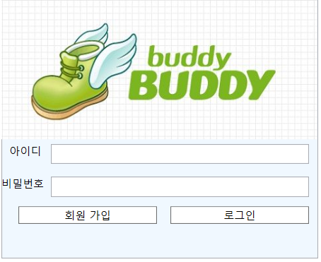

오늘은 wpf MainWindow를 xaml로 꾸미고, cs로 기능을 구현해봤습니다. 
먼저 MainWindow.xaml 화면을 보여드리겠습니다.  
 

이게 제 MainWindow 입니다 ㅎㅎㅎ... (추억의 버디버디ㅎ) 

일단 제 기능들을 말씀드리겠습니다. 

## 1. 회원 가입. 
말 그대로 회원 가입 입니다. 회원 가입을 누르면, 새로운 창이 뜨게 됩니다.(다른 창 -> 다른 cs파일) 
새로운창은 회원 가입 화면이고, 회원 가입 창에 대한 것은, 다음 시간에 다루겠습니다.(오늘은 Main Window만 ㅎ) 
> 참고. 새로운 창을 띄우기 
Window 원하는 이름 = new 새로운 창 이름(); 
원하는 이름.Show();

## 2. 로그인. 
이것도 말 그대로 로그인 입니다. 로그인을 누르면 사용자가 입력한 ID,PASSWORD를 Database 안에 있는  
ID,PASSWORD와 비교 해서, 3가지 기능을 수행하게 됩니다. 

1. ID는 DB에 존재하지만, 그 ID의 PASSWORD가 다를때. 
'비밀번호 틀림.' 문구를 출력  
2. ID가 DB에 존재하지 않는다. 
'ID와 PASSWORD를 확인해주세요' 문구를 출력  
3. ID가 DB에 존재하고, 그 ID의 PASSWORD가 같을때. 
'로그인 성공.' 문구를 출력하고, 로그인이 된 새로운 창이 뜨게 됩니다. 
이 새로운 창은 로그인 화면이고, 로그인 화면에 대한 것은, 다음 시간에 ㅎ 
 
이 로그인 기능을 가능하게 해준 것이 바로 MySql!!!!입니다. 
DB에 회원가입을 한 정보들을 저장하여서, 사용자가 로그인을 시도하려고 할때, DB에 저장되어 있는 값과 비교를 해서 
로그인을 할 수 있는지 없는지 검사를 해줍니다. 
이제 코드를 파헤쳐보겠습니다. 

~~~
 private string str()
        {
            string conn = "Server=localhost; Port=3306; Database=member; Uid=root; Pwd=emforhsqhf1";
            return conn;
        }
~~~

~~~
private void Login_Click(object sender, RoutedEventArgs e)
        {
            MySqlConnection damin1 = new MySqlConnection(str());
            string ID1 = id.Text;
            string PASSWORD1 = password.Password;
            string idquery = "SELECT password FROM members WHERE id='" + ID1 + "'";
            damin1.Open();
            MySqlCommand daminid = new MySqlCommand(idquery, damin1);
            MySqlDataReader idreader = daminid.ExecuteReader();
            Application.Current.Properties["id"] = ID1;
            try
            {
                if (idreader.Read())
                {
                    if (PASSWORD1.Equals(idreader["password"] as string))
                    {
                        MessageBox.Show("로그인 성공");
                        Window loginpage = new LoginPage();
                        loginpage.Show();
                        this.Close();
                    }
                    else
                        MessageBox.Show("비밀번호 틀림");
                }
                else
                {
                    MessageBox.Show("아이디,비밀번호를 확인해주세요");
                }
            }
            catch (Exception ex)
            {
                MessageBox.Show(ex.ToString());
            }
            finally
            {
                damin1.Close();
            }
        }
~~~

 
이게 제 MainWindow 버튼 클릭 이벤트 입니다. 파헤쳐 봅시다.  

> MySqlConnection damin1 = new MySqlConnection(str());

damin1 이라는 MySqlConnection 객체를 만들어 주었고, string으로 사용자가 쓴 ID와 PASSWORD를 저장해주었습니다.  
idquery로 MySqlCommand에 들어갈 query를 만들어 주었습니다. 

**idquery 해석 = members에서 사용자에게 입력받은 아이디(ID1)와 같은 아이디의 password를 읽어와라.** 

> damin1.Open();

MySqlCommand와 MySqlDataReader를 사용하기 위해 MySql을 열어 주었다. 

> MySqlCommand daminid = new MySqlCommand(idquery, damin1);

idquery를 사용하기 위해 daminid라는 MySqlCommand 객체를 만들어 주었고 

> MySqlDataReader idreader = daminid.ExecuteReader();

데이터를 읽는 MySqlDataReader idreader를 만들어서 daminid Command를 실행한 결과를 담았다. 
> Select과 같은 데이터를 읽어오는 것은 ExcuteReader를 사용하고,  
delete,create,update같은 명령어들은 Nonquery를 사용한다.
 

> if (idreader.Read())

만약 idreader에서 읽은 것이 있다면, id는 존재한다는 뜻이 된다. 
따라서 if문으로 나눠 줬고, 내가 가져온 데이터는 그 해당 id의 password이기 때문에, 
이것을 활용하여 '로그인 성공'과 '비밀번호 틀림'으로 구별해줬다.  
만약 idreader에서 읽은 것이 없다면, 밑에 있는 else구문을 실행한다. 
Connection의 오류가 있을 수 있기 때문에, try catch를 썼고, 마지막에는 db를 닫아줬다.  

이렇게 제 MainWindow의 cs파일을 파헤쳐봤습니다. 긴 긁 읽어주셔서 감사합니다.
