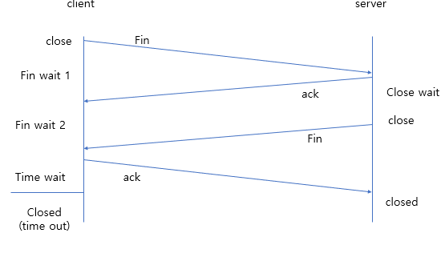

## 소켓의 우아한 연결 종료

TCP에서는 연결과정보다 중요한 것이 종료과정이다.

연결과정에서는 큰 변수가 발생하지 않지만 종료과정에서는 예상치 못한 일이 발생할 수 있기 때문이다.

윈도우에서 closesocket 함수 호출 = 완전 종료를 의미한다.

완전종료란?

> 데이터를 전송하는 것, 수신하는 것 불가능한 상황

만약 한쪽에서의 일방적인 closesocket 함수 호출(완전 종료)을 한다면?

예를 들어보자.

Alice 와 Bob이 있다.

Alice가 Bob에게 데이터를 전송하고 나서 close 함수 호출을 통해 연결을 종료 하였다.

이러면 이제부터 Alice는 Bob이 전송하는 데이터를 받지 못한다.

만약, Bob이 전송한 데이터가 정말 중요한 거라면?

수신하지 못하기 때문에 그냥 소멸되고 만다.

이러한 이유 때문에 함부로 socket을 닫는 행위는 좀 껄끄럽게 된다.

그래서 우아한 종료가 필요하다.

> 간단 정리 : 우아한 종료는 중요한 정보를 보내거나 받는 도중 소켓을 닫지 않기 위해 필요하다.

이러한 문제의 해결을 위해서 데이터의 송수신에 사용되는 스트림의 일부만 종료(Half-close) 하는 방법이 제공되고 있다.

일부만 종료란?

> 전송은 가능하지만 수신이 불가하거나, 수신이 가능하지만 전송이 불가능한 상황

소켓을 통해서 두 호스트가 연결되면, 그 다음부터는 상호간에 데이터 송수신이 가능한 상태가 된다.

이를 '스트림이 형성된 상태'라고 한다.

또, 소켓의 스트림은 한쪽 방향으로만 데이터의 이동이 가능하기 때문에 양방향 통신을 위해서는 두 개의 스트림이 필요하다.

> Alice -> Bob, Bob -> Alice

### 접속 종료 과정(4-way handshake)

1. client에서 closesocket() 이나 shutdown(SD_SEND)을 호출할 경우, 세션을 종료한다는 의미로 FIN 패킷 전송

2. client는 Fin_wait_1 상태가 될 것이다, server는 Fin을 받고 종료할 준비를 하게 될 것이다. 준비가 완료되면(Close_wait) 상태가 되고, 잘 받았다는 의미로 ACK 패킷을 client에 전송 한다.

3. Close_wait 상태가 된 server는 closesocket()함수를 호출하여 client에 Fin 패킷을 전송한다.

4. Fin을 받은 client는 이에 대한 ack 패킷을 보내고 나면 세션을 종료할 수 있는 상태가 된다. 

5. Time wait 상태는 Fin을 수신하더라도 바로 종료하지 않고 일정시간(기본 값 240초) 동안 패킷 상대가 패킷을 다 보낼 때까지 기다리는 작업.

